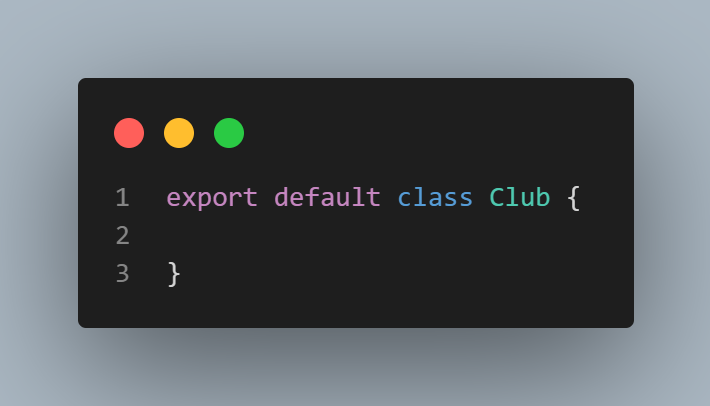
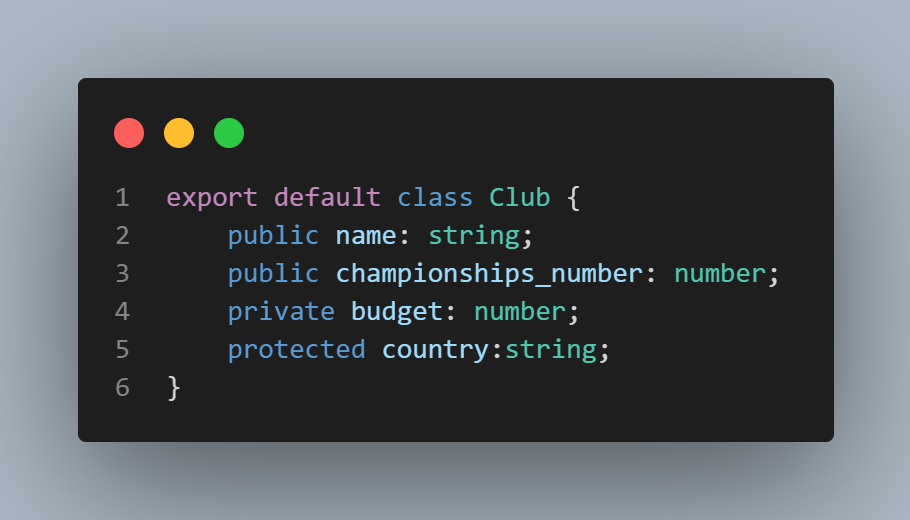
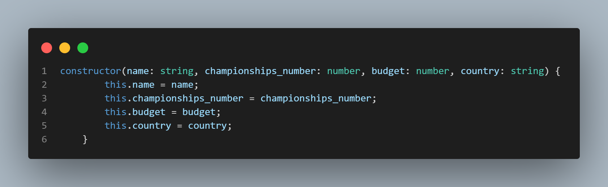
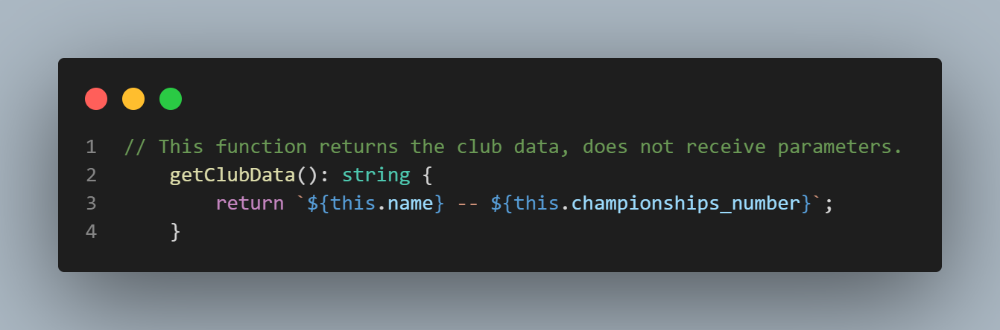
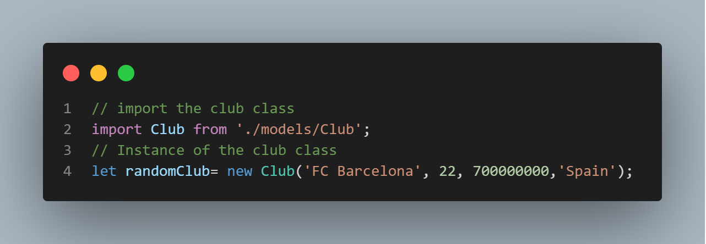

<h1 align="center">Typescript OOP Guide</h1>

## What is OOP

Object-oriented programming (OOP) is a computer programming model that organizes software design around data, or objects, rather than functions and logic. An object can be defined as a data field that has unique attributes and behavior.

## Class

In OOP, in each document, we would  have only one class, in this image we could appreciate an example of a class creation in typescript.

## Access Modifiers

### Private

The private modifier limits the visibility to the same-class only. When you add the private modifier to a property or method, you can access that property or method within the same class. Any attempt to access private properties or methods outside the class will result in an error at compile time.

### Public

The public modifier allows class properties and methods to be accessible from all locations. If you don’t specify any access modifier for properties and methods, they will take the public modifier by default.

### Protected

The protected modifier allows properties and methods of a class to be accessible within same class and within subclasses.
When a class (child class) inherits from another class (parent class), it is a subclass of the parent class.
The TypeScript compiler will issue an error if you attempt to access the protected properties or methods from anywhere else.

### Example of Access Modifiers

# Constructor

Constructors essentially allow the creation of objects from classes.
Classes act like a blueprint for typing the objects you create with the necessary properties and methods.

# Functions And Methods

Functions are the building blocks of readable, maintainable, and reusable code. A function is a set of statements to perform a specific task. Functions organize the program into logical blocks of code. Once defined, functions may be called to access code. This makes the code reusable. Moreover, functions make it easy to read and maintain the program’s code.

A function declaration tells the compiler about a function's name, return type, and parameters. A function definition provides the actual body of the function.

# Instances

